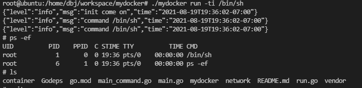

[Dot Dot Considered Harmful](https://fuchsia.googlesource.com/docs/+/d4f9b980f18fc6722b06abb693240b29abbbc9fc/dotdot.md)

[namespaces](https://fuchsia.dev/fuchsia-src/concepts/process/namespaces)

namespace部分提到了，zircon原生提供文件隔离机制

The `fuchsia.io` FIDL library provides protocols for file and directory operations. Fuchsia uses the `fuchsia.io` protocols to provide a namespace to components through which components can access system services and resources. The names in these namespaces follow certain conventions, which are part of the system ABI. See [namespaces](https://fuchsia.dev/docs/concepts/process/namespaces) for more details.

Go语言的代码研究

go version

export PATH=$PATH:/usr/local/go/bin

