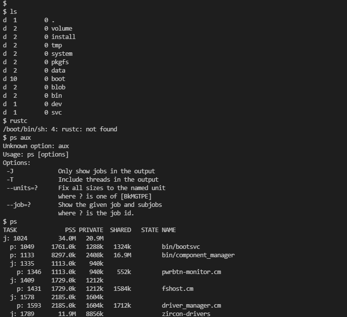

# 运行zCore的记录

## 1.git clone

git clone https://github.com.cnpmjs.org/rcore-os/zCore --recursive cd zCore

## 2.安装git-lfs
`curl -s https://packagecloud.io/install/repositories/github/git-lfs/script.deb.sh | sudo bash `

`sudo apt-get install git-lfs `

`git lfs install`

看到如下提示即成功 

>Git LFS initialized.

继续运行`git lfs pull`
## 3.make rootfs
`make rootfs`

## 4.make run

注意是在目录`zCore`下

漫长的下载。。。

直接按照INFO输出貌似会超时

在助教Deathwish42帮助下将目录zCore/rboot.conf下的info改为warn


```diff

-cmdline=LOG=info:TERM=xterm-256color:console.shell=true:virtcon.disable=true

+cmdline=LOG=warn:TERM=xterm-256color:console.shell=true:virtcon.disable=true

```


## 5.启用kvm加速

运行`make run accel=1`

### 遇到报错failed to initialize kvm: Permission denied

直接`sudo chmod 666 /dev/kvm`再次make run 就行

### 我还遇到了报错qemu-system-x86_64: error: failed to set msr 0x48f to 0x7fffff00036dfb qemu-system-x86_64: ../../target/i386/kvm.c:2701: kvm_buf_set_msrs: assertion `ret == cpu->kvm_msr_buf->nmsrs' failed.

参考[这一篇](https://github.com/minishift/minishift/issues/3210)

打开了VMware的虚拟化CPU性能计数器


## 6.运行之后即可看到shell


