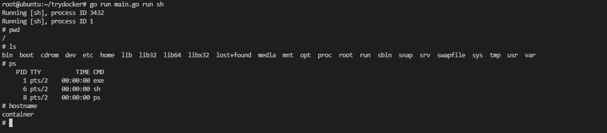

# trydocker
GO/Rust 的容器尝试
# 运行需要镜像
```shell
mkdir alpine
cd alpine
curl -o alpine.tar.gz http://dl-cdn.alpinelinux.org/alpine/v3.10/releases/x86_64/alpine-minirootfs-3.10.0-x86_64.tar.gz
tar xvf alpine.tar.gz
rm alpine.tar.gz
cd ..
```
# 请替换 chroot 部分的`/path/to/alpine`
# Go
## 环境
go version go1.16.7 linux/amd64
Ubuntu 21.04

Go语言代码[参考](https://www.katacoda.com/lizrice/courses/containers-and-go/scratch)

## 运行命令 !需要root权限
```shell
go run main.go run sh
```
## 效果


# Rust
## 运行命令 !需要root权限
```
cargo build
./target/debug/rustcontainer run
```


# 关键技术

### namespace

syscall.CLONE_NEWUTS  主机名称隔离

syscall.CLONE_NEWPID   进程隔离

syscall.CLONE_NEWNS    挂载点隔离

### chroot                                
文件隔离