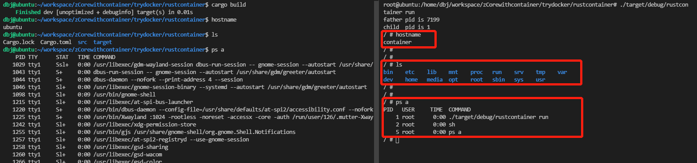

# trydocker
Go/Rust 的linux容器尝试

设计请移步[至](../doc/summary.md)

# 运行需要镜像
```shell
mkdir alpine
cd alpine
curl -o alpine.tar.gz http://dl-cdn.alpinelinux.org/alpine/v3.10/releases/x86_64/alpine-minirootfs-3.10.0-x86_64.tar.gz
tar xvf alpine.tar.gz
rm alpine.tar.gz
cd ..
```
# ！请替换 chroot 部分的`/path/to/alpine`
# Go
## 环境
go version go1.16.7 linux/amd64
Ubuntu 21.04

Go语言代码[参考](https://www.katacoda.com/lizrice/courses/containers-and-go/scratch)

## 运行命令 !需要root权限
```shell
go run main.go run sh
```

# Rust
## 运行命令 !需要root权限
```shell
cargo build
./target/debug/rustcontainer run
```
# 效果
Go/Rust效果一样，可以分别通过命令行
|命令|作用|
|--|--|
|`hostname`|  检查主机名称隔离|
|`ls`|检查文件隔离|
|`ps a`|检查进程隔离|


## 退出容器
```shell
exit
```

# 关键技术

### 使用clone系统调用的时候传入cloneflag新建namespace
`clone` 相比于 `fork`有更加细粒度的控制 详见[clone(2) — Linux manual page](https://man7.org/linux/man-pages/man2/clone.2.html)

用到的cloneflag
syscall.CLONE_NEWUTS  主机名称隔离

syscall.CLONE_NEWPID   进程隔离

syscall.CLONE_NEWNS    挂载点隔离

### 文件隔离直接用chroot，但可能面临逃逸风险                                
